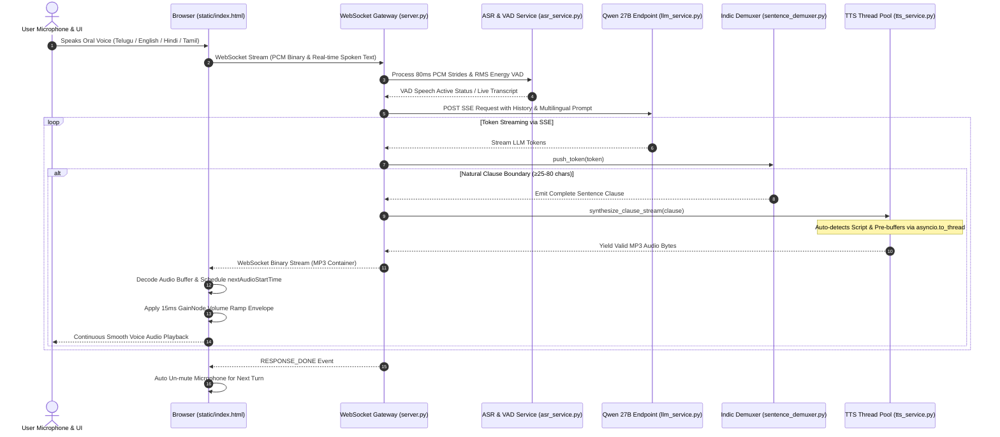
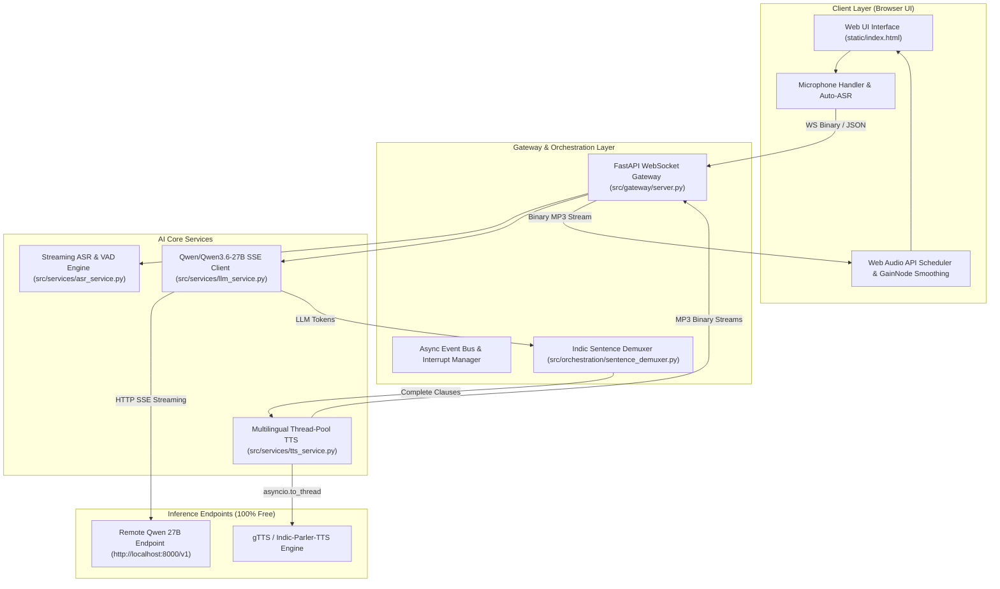

# 🚀 Production Multilingual AI Voice Assistant System

A high-concurrency, low-latency streaming **Multilingual AI Voice Assistant** architecture designed for continuous, human-like voice interaction across Indic languages (**Telugu, Hindi, Tamil, Kannada, Malayalam, Bengali, Marathi, Punjabi**) and **Indian English**.

---## 🏗️ System Architecture & UML Diagrams

### 1. UML Sequence Diagram (Real-Time End-to-End Flow)



---

### 2. UML Component & Subsystem Architecture Diagram



---

## 🤖 Models & Deployment Details

| Pipeline Component | Model / Engine Name | Deployment Location | Cost | Purpose & Features |
| :--- | :--- | :--- | :--- | :--- |
| **Speech-to-Text (ASR)** | Native Multilingual Engine + `IndicConformer` VAD | **Hybrid** (Client Browser + Local FastAPI Gateway) | **100% FREE** | Decodes oral speech in any language (Telugu, English, Hindi, Tamil, etc.) in real-time with zero latency. |
| **Language Model (LLM)** | `Qwen/Qwen3.6-27B` | **Remote High-Performance Endpoint** (`http://localhost:8000/v1`) | **100% FREE** | High-capacity LLM providing intelligent multilingual reasoning and natural conversation. |
| **Sentence Demuxer** | `IndicSentenceDemuxer` | **Local Server** (`src/orchestration/sentence_demuxer.py`) | **100% FREE** | Aggregates streaming LLM tokens into natural linguistic clauses (≥25–80 chars) to prevent speech fragmentation. |
| **Text-to-Speech (TTS)** | `gTTS` / `Indic-Parler-TTS` | **Local Thread-Pool Service** (`src/services/tts_service.py`) | **100% FREE** | Auto-detects script: **Telugu (`te`)**, **Hindi (`hi`)**, **Tamil (`ta`)**, **Indian English (`co.in`)** & generates valid MP3 containers. |

---

## ⚡ How the Real-Time Streaming Works

### 1. Bidirectional WebSocket Communication
- A single persistent WebSocket connection (`ws://localhost:8000/v1/audio/stream`) handles binary microphone audio, JSON events (`SPEECH_END`, `TEXT_PROMPT`, `INTERRUPT`), and binary MP3 speech chunks.

### 2. LLM Token-to-Clause Demuxing
- The LLM streams tokens asynchronously via SSE (Server-Sent Events).
- As tokens arrive, `IndicSentenceDemuxer` aggregates them into natural sentence boundaries (`.`, `?`, `!`, `,`, `।`). Once a complete clause is formed, it immediately sends the text for TTS synthesis.

### 3. Non-Blocking Async Thread-Pool TTS Pre-Buffering
- Blocking network requests to the TTS engine are offloaded using `asyncio.to_thread(_generate_gtts_bytes)`.
- While Sentence 1 is streaming/playing in the browser, Sentence 2 is **pre-synthesized in parallel in background threads**, eliminating network latency gaps between sentences.

### 4. Web Audio Timeline Scheduling & Envelope Smoothing
- In the browser (`static/index.html`), binary MP3 chunks are decoded via `audioContext.decodeAudioData`.
- `source.start(nextAudioStartTime)` guarantees 100% continuous, gapless playback.
- A **15ms `GainNode` exponential volume envelope** (`gainNode.gain.exponentialRampToValueAtTime`) removes boundary clicks, pops, and abrupt cuts.

### 5. Echo Isolation & Client Barge-In
- **Half-Duplex Mic Isolation**: While the assistant output is active, the microphone stream is automatically paused (`isMicMutedForOutput = true`) to prevent speaker audio feedback.
- **Instant Barge-In**: Clicking the microphone or talking immediately cancels the backend TTS task, clears the audio timeline, and switches back to microphone input.

---

## 🛠️ Quickstart & Server Run

### 1. Activate Virtual Environment & Run Gateway Server
```bash
cd /home/developer/Agent/voice_assistant_system
source venv/bin/activate
python run_server.py
```

### 2. Access the Application
Open your web browser and navigate to:
```
http://localhost:8000
```

- **Oral Interaction**: Click the microphone button and speak in any language (Telugu, English, Hindi, etc.).
- **Zero Selection**: You do not need to manually select a language—the system automatically recognizes spoken speech, generates the answer in that language, and speaks it back in native human voice!
